# 问卷调查项目--“问卷Online”

### 使用的技术
* 开发语言：Jdk 9+
* Web框架：Spring Boot2+,Thymeleaf
* 数据库：MySQL5.5+
* 前端技术：Layui+Jquery+JqueryUI
* 构建工具：Maven3.5+

### 主要功能
* 登录/注册
* 用户中心
* 创建/发布问卷
* 问卷分享，快速收集
* 结果分析与统计
* 丰富的问卷调查模板
* ... ...

### 数据库ER图

### 运行与部署文档
- [本地运行与部署文档](docs/RUN_DEPLOY.md)
- [docker部署文档](docs/DOCKER_DEPLOY.md)

### 运行截图
#### 登录/注册
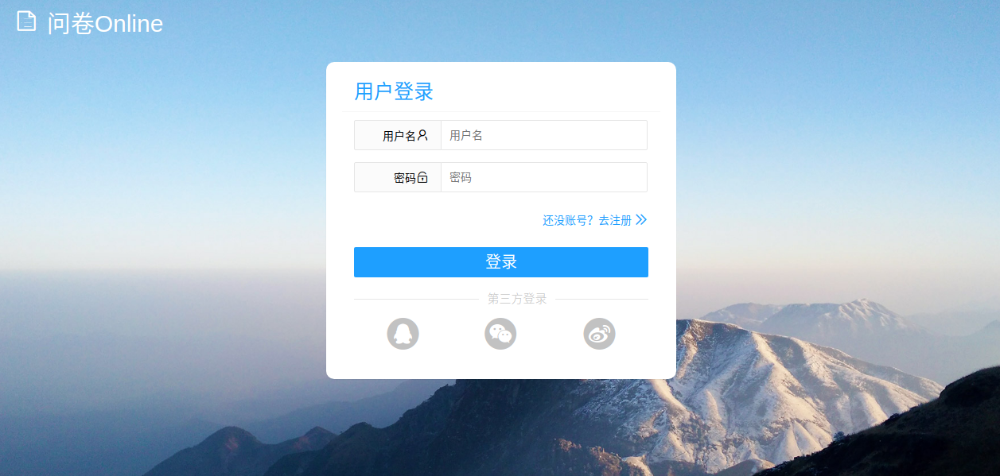
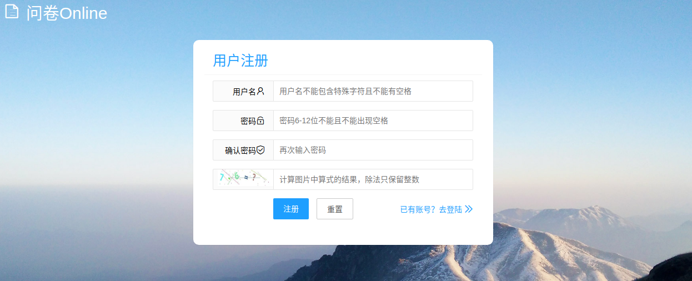

#### 主页
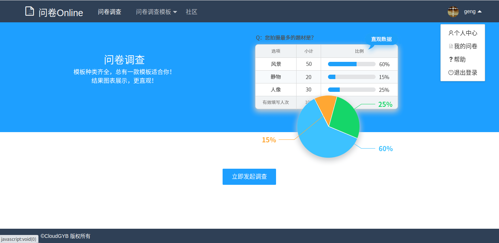

#### 问卷模板
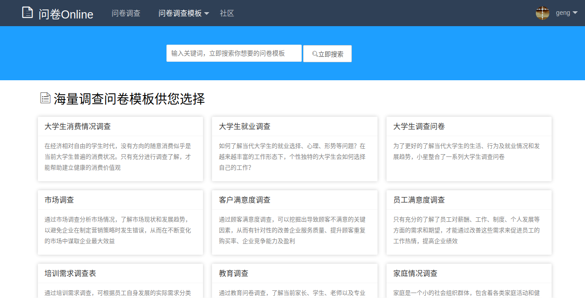
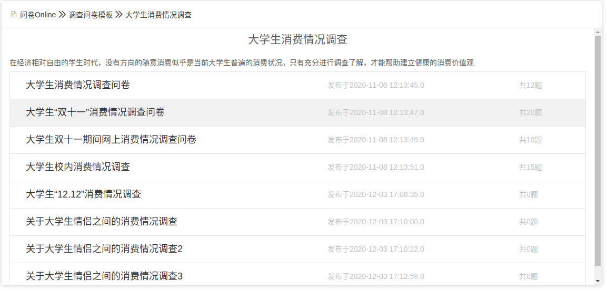

#### 模板预览
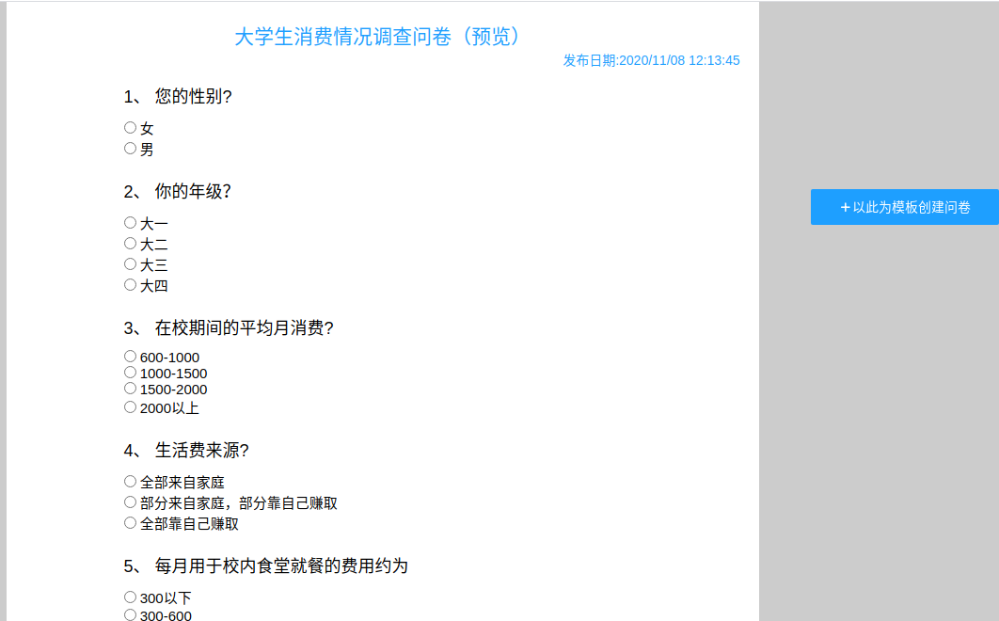

#### 创建问卷
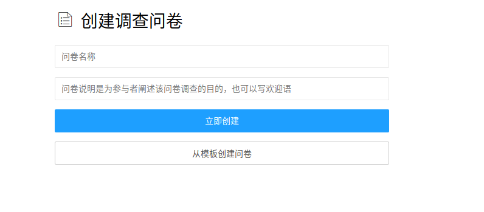

#### 问卷设计
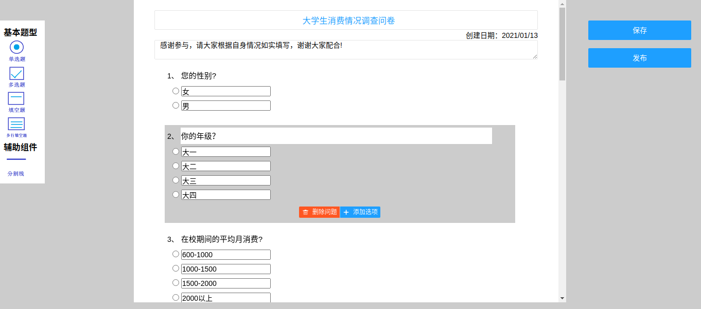

#### 我的问卷
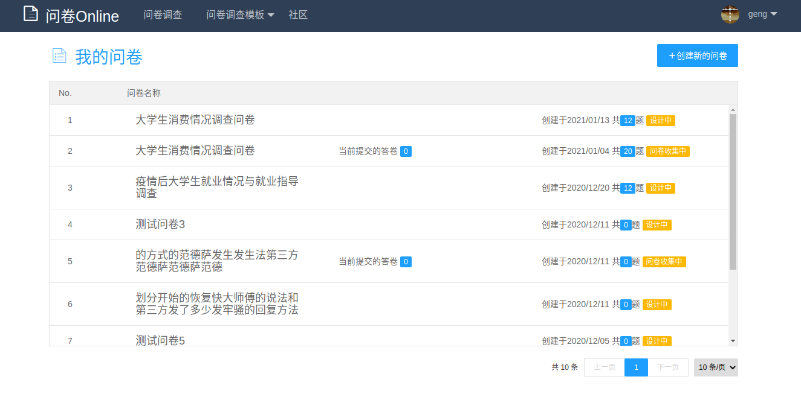

#### 问卷分享
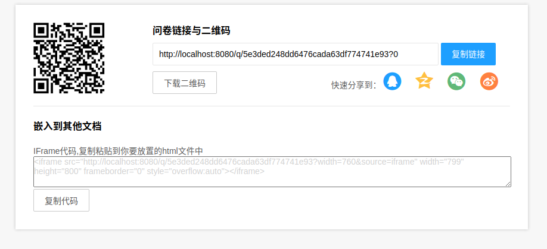

#### 问卷报告
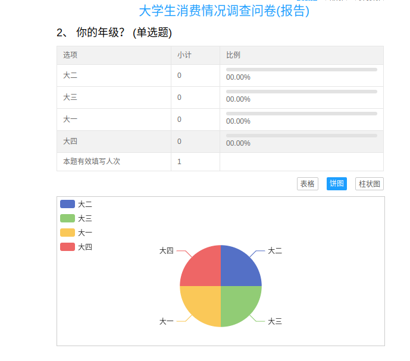

#### 个人中心
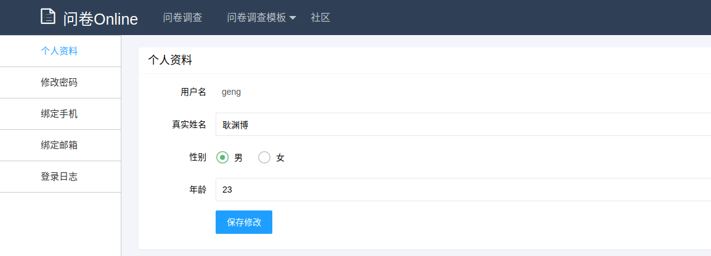
